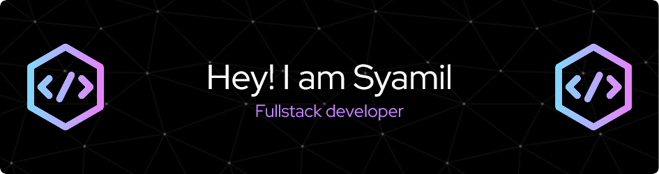

# Hello, folks! 

Hi my name is Aizad.

 
 

### Skills

### Tools

### Others

### Statistics

<!---
aizad1997/aizad1997 is a ✨ special ✨ repository because its `README.md` (this file) appears on your GitHub profile.
You can click the Preview link to take a look at your changes.
--->
